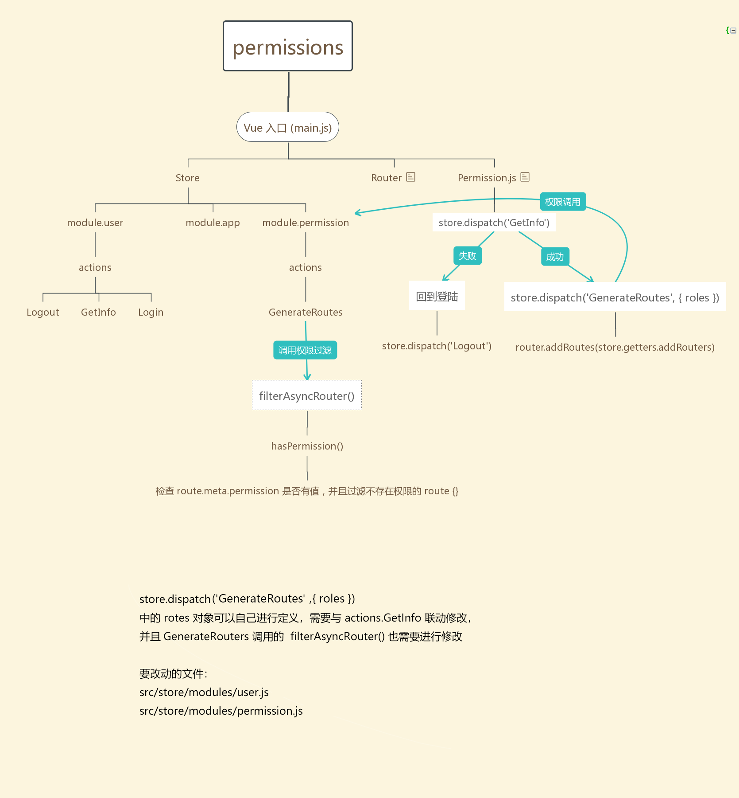
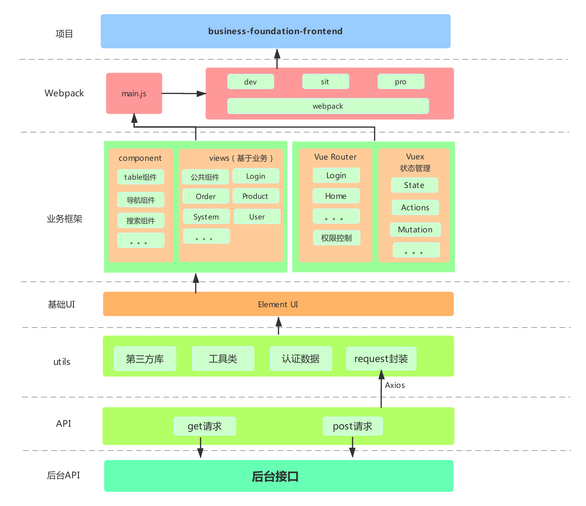

# vue-element-core

## Project setup

```bash
npm install
```

### Compiles and hot-reloads for development

```bash
npm run serve
```

### Compiles and minifies for production

```bash
npm run build
```

### Eslint & Standard

This project use eslint specification code. And the rule extends from 'standardjs'.
Before 'git commit', it will use githooks to format all codes.
See '.eslintrc.js' for details.

### Permission control



- Async router from api to control pages permission.
- CURD authority from api to control page's button permission.

Follow this json infos to set permissions.

> - `code` for permission type.
> - `status` for permission value.
> - `type` for router level

```javascript
{
  code: '1',
  result: {
    ...userinfos,
    permissions: [
      {
        id: 1,
        name: 'product',
        code: 'product',
        status: 1,
        type: 0,
        children: [
          {
            id: 11,
            name: 'Attributes Management',
            code: 'product:attributes',
            status: 1,
            type: 1,
            children: [
              {
                id: 111,
                name: 'list',
                code: 'product:attributes:list',
                status: 1, // has permission
                type: 2,
              },
              {
                id: 112,
                name: 'add',
                code: 'product:attributes:add',
                status: 0, // no permission
                type: 2
              }
            ]
          },
        ]
      }
    ]
  }
}

```

### Project structure

```bash

├── public
│   └── logo.png             # LOGO
|   └── index.html           # Vue 入口模板
├── src
│   ├── api                  # 后台接口Api，建议跟views文件夹下页面对应
│   ├── assets               # 本地静态资源
│   ├── config               # 项目基础配置，包含路由，全局设置
│   ├── components           # 业务通用组件
│   ├── core                 # 项目引导, 全局配置初始化，依赖包引入等
│   ├── layouts              # 页面整体布局组件
│   ├── locales              # 国际化资源
│   ├── mock                 # mock数据，实际项目可以删除
│   ├── router               # Vue-Router
│   ├── store                # Vuex
│   ├── utils                # 工具库
│   ├── views                # 业务页面入口和常用模板
│   ├── App.vue              # Vue 模板入口
│   └── main.js              # Vue 入口 JS
├── README.md
└── package.json

```

### Framework diagram



### TODO

```bash

├── components
│   └── table
|   └── locker
|   └── upload
|   └── editor
|   └── Number-Input

```

```bash

├── filters
│   └──
|   └──
|   └──
|   └──

```

```bash

├── directive
│   └──
|   └──
|   └──
|   └──

```
